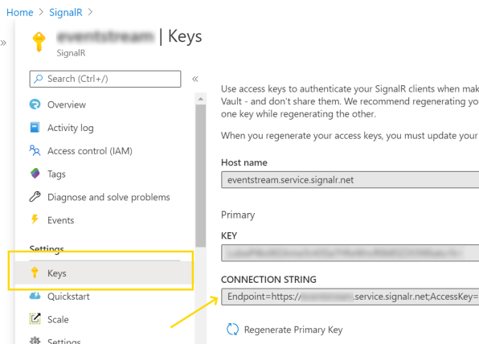
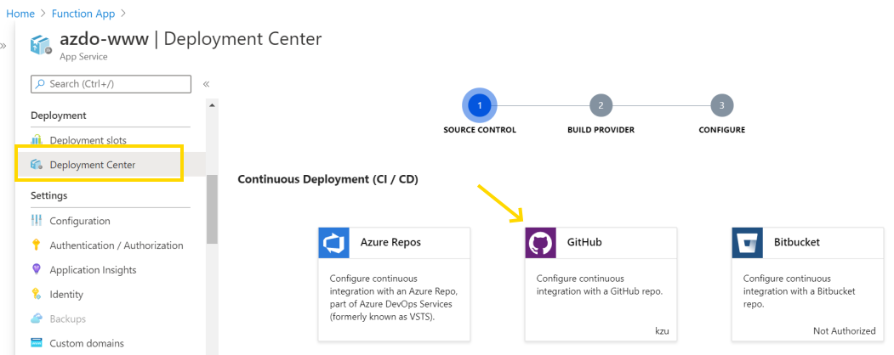
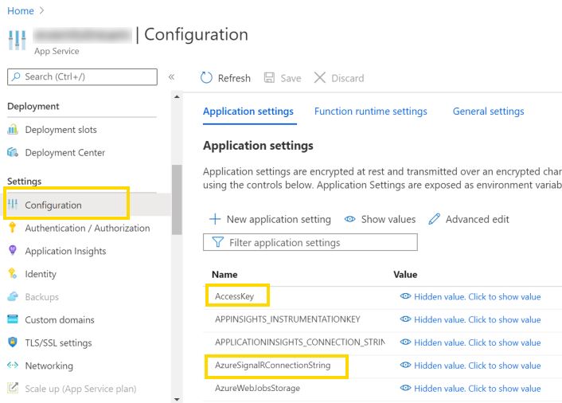
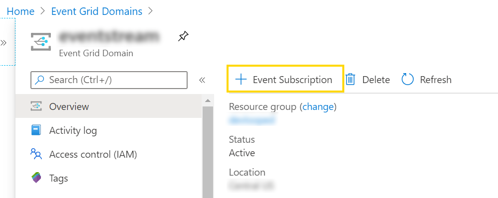
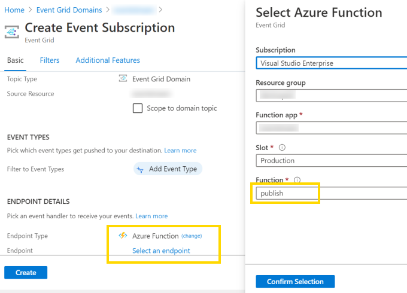

 EventGrid Tool
============

An Azure Function app with an EventGrid-trigger function that forwards events 
to an Azure SignalR service, and an accompanying `dotnet` global tool to 
connect to it and receive the streaming events in real-time.


## Why

I find the [Azure EventGrid Viewer](https://github.com/Azure-Samples/azure-event-grid-viewer) 
quite lacking and stagnating, it's [just a sample after all](https://docs.microsoft.com/en-us/samples/azure-samples/azure-event-grid-viewer/azure-event-grid-viewer/).
Also, I'm much more into [dotnet global tools](https://docs.microsoft.com/en-us/dotnet/core/tools/global-tools) 
than web pages, having created a bunch of others like [dotnet-vs](https://github.com/kzu/dotnet-vs), 
[guit](https://github.com/kzu/guit), [dotnet-file](https://github.com/kzu/dotnet-file) and 
[dotnet-config](https://github.com/kzu/dotnet-config) ¯\_(ツ)_/¯

## Deploy

The dotnet global tool `eventgrid` connects to a SignalR service that broadcasts events with a 
specific format (basically, just JSON-serialized [EventGridEvent](https://docs.microsoft.com/en-us/dotnet/api/microsoft.azure.eventgrid.models.eventgridevent?view=azure-dotnet) 
objects). In order to receive those, we need to connect an EventGrid subscription (thorugh an 
Azure function) to SignalR. Since the resources, cost and privacy issues involved are non-trivial, 
we don't provide a ready-made service you can just connect your EventGrid events to. 

Instructions to deploy the cloud pieces on your own Azure subscription:

1. The first step to getting your own event grid events routed to the tool is to 
   set up a [Azure SignalR service](https://portal.azure.com/#create/Microsoft.SignalRGalleryPackage) if 
   you don't have one already. There is a [free tier](https://azure.microsoft.com/en-us/pricing/details/signalr-service/) 
   that allows 20 simulaneous connections and up to 20k messages per day.
   Once created, open the Settings > Keys pane and copy the `Connection String`.

    > 

3. Next comes the [Function App](https://portal.azure.com/#create/Microsoft.FunctionApp). Create 
   an empty one, using .NET Core 3.1. The simplest way to deploy the code to it is to select the 
   `Deployment Center` pane, select `GitHub` for source control (point it to your fork of this repo) 
   and `App Service build service` for the build provider.

    > 

    > 

4. Now we need to configure a couple application settings in the function app:
   * `AzureSignalRConnectionString`: set it to the value copied in step 2.
   * Optionally, create an `AccessKey` value with an arbitrary string to use as a shared 
     secret to authorize connections from the client. You will need to append that key to 
     the url passed to the `eventgrid` tool, like `eventgrid https://myfunc.azurewebsites.net/?key=...`

    > 

5. The final step is to start sending events to the function app just created. 
   Go to all the relevant EventGrid services you have (or [create a new one](https://portal.azure.com/#create/Microsoft.EventGridDomain)) 
   and set up the subscriptions to push as much or as little as you need to visualize 
   on the tool. Keep in mind that the tool can also do filtering on the client side, 
   so that you don't need to constantly update the subscriptions. During development, 
   it can be convenient to just create a single global subscription with no filters 
   and just filter on the client. Beware of the SignalR service limits for the tier 
   you have selected, though.

   You just need to create a new Event Subscription and select the `Azure Function` 
   endpoint type, and point it to the deployed function app from step 3.

    > 

   The function will be named `publish` once you select the right subscription, 
   resource group and function app

    > 


## Install

Now you can install the dotnet tool that connects to your cloud infrastructure:

```
dotnet tool install -g dotnet-eventgrid
```

Update:

```
dotnet tool update -g dotnet-eventgrid
```


## Usage

```
Usage: eventstream [url] [--] -[property]* +[property=minimatch]*
      +all                    Render all properties
      -property               Exclude a property
      +property[=minimatch]   Include a property, optionally filtering
                              with the given the minimatch expression.

Examples:
- Include all event properties, for topic ending in 'System'
      eventstream https://mygrid.com +all +topic=**/System

- Exclude data property and filter for specific event types
      eventstream https://mygrid.com -data +eventType=Login

- Filter using synthetized path property '{domain}/{topic}/{subject}/{eventType}'
      eventstream https://mygrid.com +path=MyApp/**/Login

- Filter using synthetized path property for a specific event and user (subject)
      eventstream https://mygrid.com +path=MyApp/*/1bQUI/Login
```

The `url` is the address of your deployed function app, which can optionally 
have an `?key=[access-key]` query string with the same value specified in the 
Function App configuration settings with the name `AccessKey`. If present, it 
will be used as a shared secret to authorize the SignalR stream connection.

Keep in mind that the built-in EventGrid format for `topic` is rather unwieldy: 
`/subscriptions/{subscriptionId}/resourceGroups/{resourceGroupName}/providers/Microsoft.EventGrid/domains/{domainName}/topics/{topicName}`. 
For this reason, we also provide a synthetized `path` property with the much 
simpler format `{domain}/{topic}/{subject}/{eventType}`, which makes filtering 
with the [minimatch](https://github.com/isaacs/minimatch) format much more 
convenient.

## Testing events

Pushing test events to EventGrid is quite simple. Provided you have a package 
reference to `Microsoft.Azure.EventGrid`, you can use the following snippet 
of C# (for example in the most excelent [LINQPad](https://www.linqpad.net/) tool) 
to push some events:

```csharp
var domain = "YOUR_EVENT_GRID_DOMAIN_ENDPOINT_HOSTNAME";                // From the Overview pane
var credentials = new TopicCredentials("YOUR_EVENT_GRID_ACCESS_KEY");   // From Access keys pane

var events = new List<EventGridEvent>
{
    new EventGridEvent(
        id: Guid.NewGuid().ToString("n"), 
        subject: "1bQUI", 
        data: JsonConvert.SerializeObject(new { FirstName = "Daniel", LastName = "Cazzulino" }), 
        eventType: "Login", 
        eventTime: DateTime.UtcNow, 
        dataVersion: "1.0", 
        topic: "Devlooped.MyApp"),
    new EventGridEvent(
        id: Guid.NewGuid().ToString("n"), 
        subject: "1XKDw", 
        data: JsonConvert.SerializeObject(new { FirstName = "Pablo", LastName = "Galiano" }), 
        eventType: "LoginFailed", 
        eventTime: DateTime.UtcNow, 
        dataVersion: "1.0", 
        topic: "Devlooped.MyApp"),
    // ...
};

using (var client = new EventGridClient(credentials))
{
    foreach (var e in events)
    {
        await client.PublishEventsAsync(domain, new List<EventGridEvent> { e });
        Thread.Sleep(1000);
    }
}
```

The above was pretty much what we used to create the animated gif at the top.
